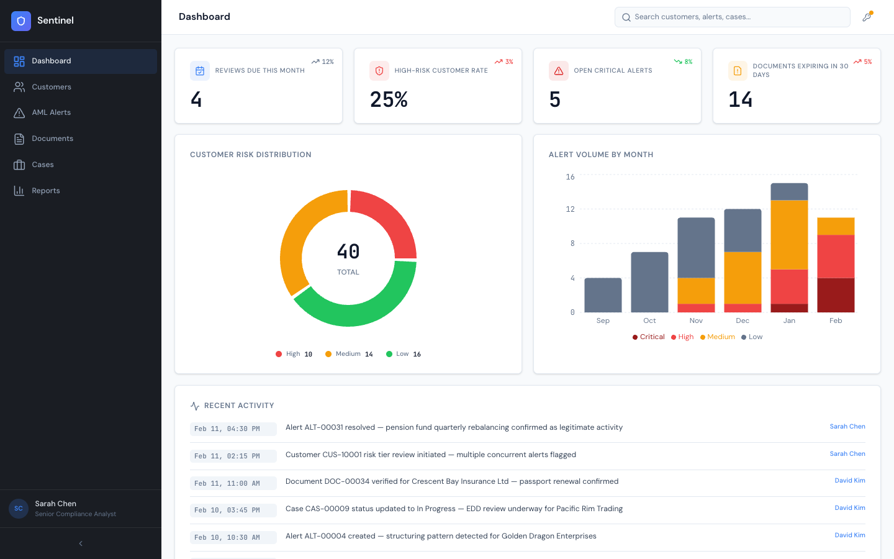

# Sentinel KYC Compliance Dashboard

A full-stack demo application for a Claude Code workshop — KYC compliance monitoring, AML alert triage, document verification, and case management for financial institutions.



## Tech Stack

- **Frontend**: React 19 + Vite (port 5173)
- **Backend**: Python FastAPI (port 8001)
- **Database**: PostgreSQL (Docker)

## Features

- **Dashboard** — KPI cards, customer risk distribution, alert volume trends, recent activity feed
- **Customers** — 360° customer profiles with risk tiers, linked alerts, documents, and cases
- **AML Alerts** — Alert management with severity levels, status tracking, and type filtering
- **Documents** — Document verification tracking with expiry monitoring
- **Cases** — Compliance case management with notes, priority levels, and status workflows
- **Reports** — Quarterly metrics, resolution rates, and SLA adherence analytics
- **AI Features** — 4 Claude-powered tools:
  - Risk Assessment (per customer)
  - Alert Triage (per alert)
  - Case Summary (per case)
  - Compliance Narrative (quarterly report generation)

## Quick Start

**Prerequisites:** Docker, Python 3.11+, Node.js 18+

**1. Start PostgreSQL:**
```bash
docker run -d --name sentinel-pg \
  -e POSTGRES_DB=sentinel \
  -e POSTGRES_USER=sentinel \
  -e POSTGRES_PASSWORD=sentinel \
  -p 5432:5432 \
  postgres:16
```

**2. Start the backend:**
```bash
cd backend
uv venv && uv sync
uv run uvicorn app.main:app --port 8001 --reload
# API: http://localhost:8001
# Docs: http://localhost:8001/docs
```

**3. Start the frontend:**
```bash
cd frontend
npm install
npm run dev
# App: http://localhost:5173
```

The database auto-seeds on first startup with demo data.

## API Endpoints

**Dashboard**
- `GET /api/dashboard/kpis` — Key performance indicators
- `GET /api/dashboard/risk-distribution` — Customer risk tier breakdown
- `GET /api/dashboard/alert-trend` — Monthly alert volume by severity

**Customers**
- `GET /api/customers` — List customers (filterable)
- `GET /api/customers/jurisdictions` — Available jurisdictions
- `GET /api/customers/{id}` — Customer detail
- `GET /api/customers/{id}/alerts` — Customer's alerts
- `GET /api/customers/{id}/documents` — Customer's documents
- `GET /api/customers/{id}/cases` — Customer's cases
- `GET /api/customers/{id}/activity` — Customer's activity log

**AML Alerts**
- `GET /api/alerts` — List alerts (filterable)
- `GET /api/alerts/types` — Alert type options
- `GET /api/alerts/{id}` — Alert detail
- `PUT /api/alerts/{id}/status` — Update alert status

**Documents**
- `GET /api/documents` — List documents (filterable)
- `GET /api/documents/types` — Document type options
- `GET /api/documents/{id}` — Document detail
- `PUT /api/documents/{id}/status` — Update verification status

**Cases**
- `GET /api/cases` — List cases (filterable)
- `GET /api/cases/types` — Case type options
- `GET /api/cases/{id}` — Case detail
- `GET /api/cases/{id}/notes` — Case notes
- `POST /api/cases/{id}/notes` — Add case note
- `PUT /api/cases/{id}/status` — Update case status

**Reports**
- `GET /api/reports/quarterly-metrics` — Quarterly compliance metrics
- `GET /api/reports/resolution-rate` — Alert resolution rates
- `GET /api/reports/sla-adherence` — SLA adherence data

**AI (Claude-powered)**
- `GET /api/ai/key-status` — Check API key configuration
- `POST /api/ai/key` — Save API key
- `DELETE /api/ai/key` — Remove API key
- `POST /api/ai/risk-assessment/{customer_id}` — Generate risk assessment (SSE)
- `POST /api/ai/alert-triage/{alert_id}` — Triage an alert (SSE)
- `POST /api/ai/case-summary/{case_id}` — Generate case summary (SSE)
- `POST /api/ai/compliance-narrative` — Generate quarterly narrative (SSE)

**Other**
- `GET /api/health` — Health check
- `GET /api/stats` — Aggregate statistics
- `GET /api/search` — Global search across entities
- `GET /api/activity` — Recent activity feed

## Demo Data

Seed data includes:
- 40 customers across multiple jurisdictions and risk tiers
- 60 AML alerts (various types and severities)
- 80 KYC documents (passports, licenses, financials)
- 30 compliance cases
- 8 analysts

Data is auto-seeded on first startup. To re-seed: `cd backend && uv run python -m app.seed`

## Production Build

```bash
cd frontend
npm run build  # Output: frontend/dist/
```

## Platform Notes

**macOS/Linux:** Commands above work as-is.

**Windows:** Use the manual startup commands — run each in a separate terminal:

Backend:
```bash
cd backend
uv venv && uv sync
uv run uvicorn app.main:app --port 8001 --reload
```

Frontend:
```bash
cd frontend
npm install
npm run dev
```

To stop the servers, press Ctrl+C in each terminal window.

---

**Note:** Demo application built for workshop use. Not production-ready without authentication, rate limiting, and security hardening.
